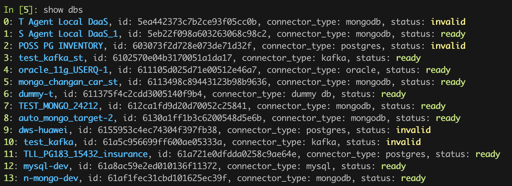
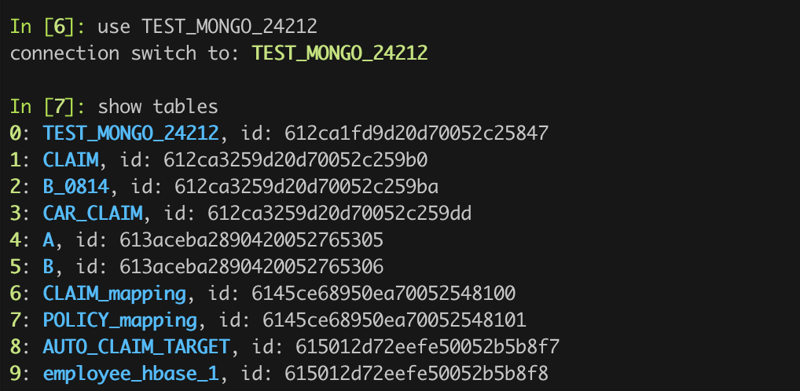
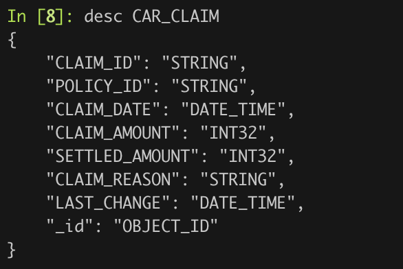

# TapFlow 命令行客户端使用文档

## 安装
1. 自行安装 python3, pip3, and ipython3 
2. 运行 `pip3 install .` 安装客户端

## 配置
1. 编辑 etc/config.ini, 填写地址与鉴权信息, 其中:

如果访问的是企业版, 请填写两个信息:
server: 企业版地址, 例如: 192.168.106.1:13030
access_code: 企业版的鉴权 token

如果访问的是云版, 只需要填写鉴权信息即可, 包括:
ak: access key
sk: secret key

## 运行
1. 在完成安装后, 运行命令 `tapcli` 即可打开命令行客户端

## 命令行模式使用手册
### 查看基本连接与表信息
0. 帮助
`h`

1. 列出所有数据源
`show dbs`


2. 切换到某个数据源, 并列出表
`use $db` 后, `show tables`


3. 探索表结构与表数据
`desc $table` 查看表结构, `peek $table` 预览表数据


### 创建数据源
1. 创建 MongoDB 数据源
```
m = DataSource("mongodb", name="mdb");
m.host("127.0.0.1:27017").db("source").username("root").password("Gotapd8!").type("source").props("authSource=admin");
m.save();
```

2. 创建 MySQL 数据源
```
m = DataSource("mysql", name="sql");
m.host("127.0.0.1").port(3306).db("source").username("root").password("Gotapd8!");
m.save();
```

### 配置与运行建模任务
```python
source = Source("qa_mongodb_repl_42240")
order = Flow("left_join_demo").read_from(source.order).filter("order_time > 2024-01-02")
def user_mapper(record):
    record["user_id"] = str(record["user_id"])
    return record
order.lookup(source.user, path="user", type=dict, relation=[["user_id", "user_id"]], mapper=user_mapper, filter="user_id > 1", fields=["user_id", "user_name"])
order.lookup(source.goods, path="goods", type=dict, relation=[["goods_id", "goods_id"]])
order.write_to(source.order_view)
order.start()
```

### 任务查看
1. 列出任务: `show jobs`
2. 查看任务状态: `status $job_name`
3. 查看任务指标: `stats $job_name`
4. 查看任务日志: `logs $job_name`
5. 开始任务: `start $job_name`
6. 停止任务: `stop $job_name`
7. 删除任务: `delete $job_name`

## 类库模式使用说明
1. 引入依赖库
`from tapflow.lib import *`
